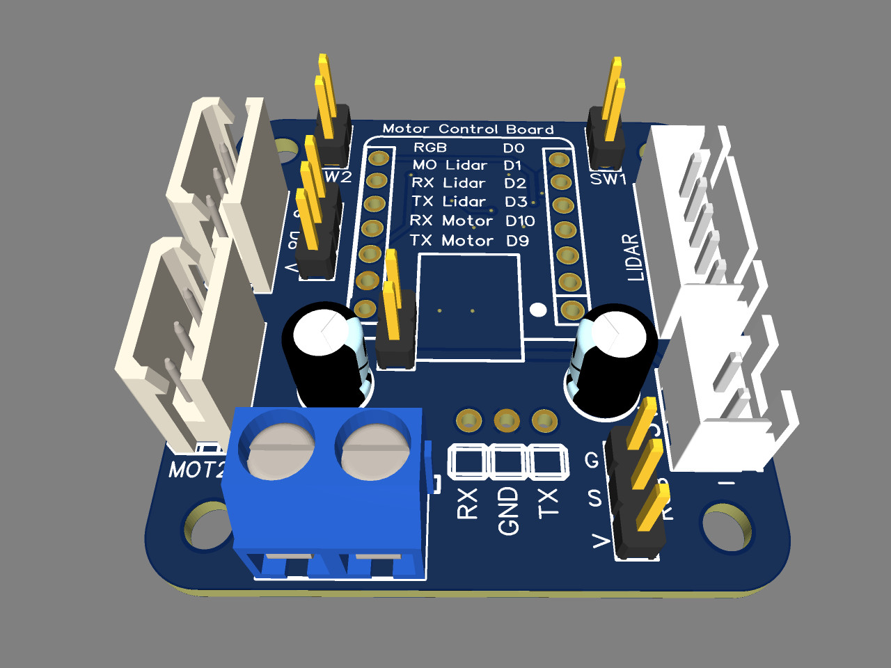
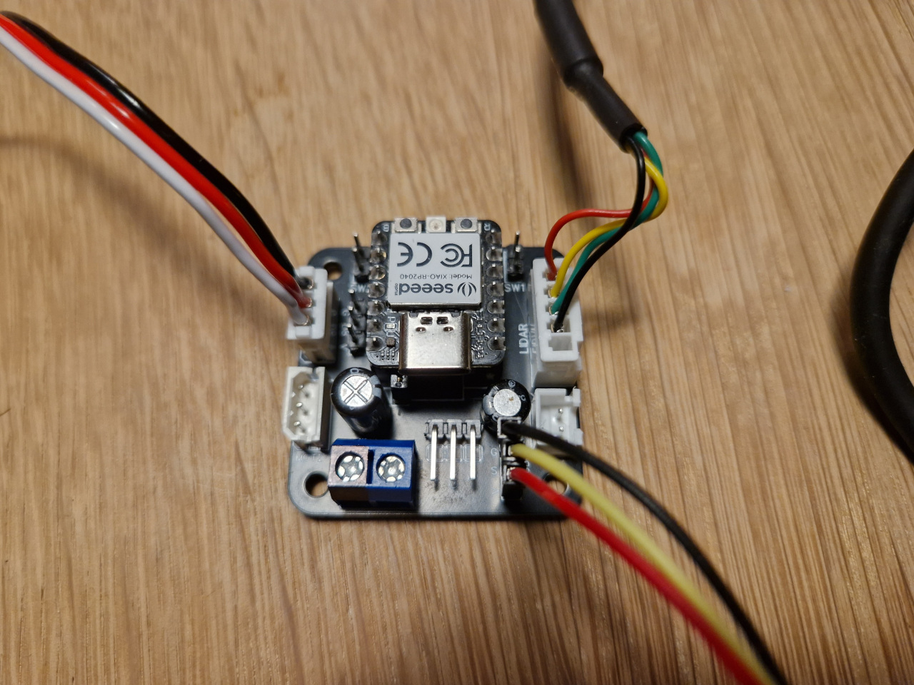
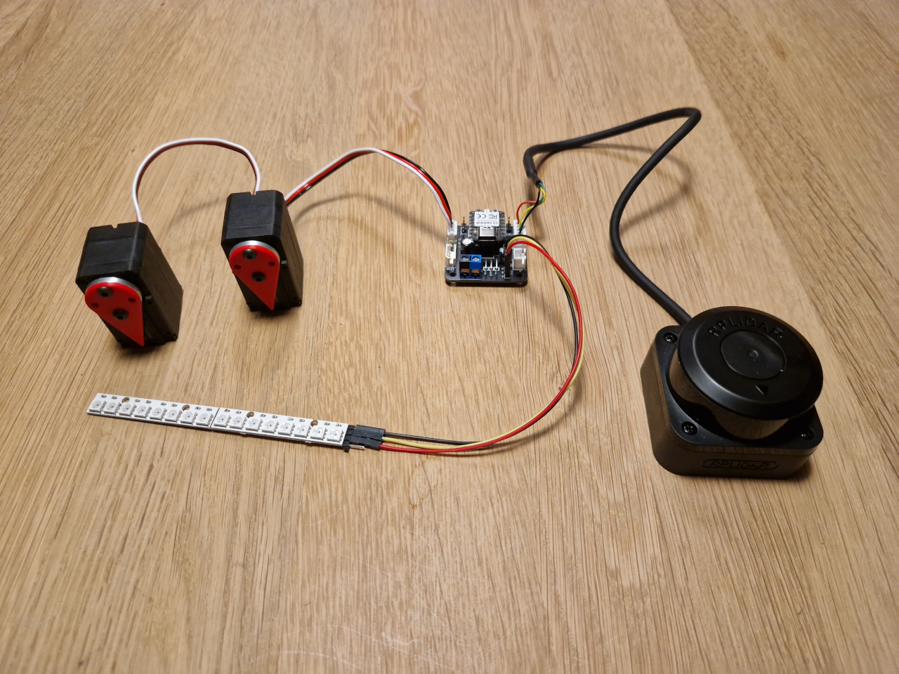

# Xiao Servo Controller

SeeedStudio Xiao smart servo controller board.

## USB Interface

The firmware configures the board as a USB composite device:
* CDC UART for smart servo
* CDC UART for lidar
* HID Keyboard for buttons
* HID Lighting for Neopixel control [Dynamic Lighting devices](https://learn.microsoft.com/en-us/windows-hardware/design/component-guidelines/dynamic-lighting-devices)

## Hardware

The board should work with one of the following microcontrollers:
* [SeeedStudio Xiao RP2040](https://wiki.seeedstudio.com/XIAO-RP2040/)
* [SeeedStudio Xiao RP2350](https://wiki.seeedstudio.com/xiao-rp2350-c-cpp-sdk/)
* [Adafruit QT Py RP2040](https://www.adafruit.com/product/4900)

## Schematic
* Schematic: [here](doc/Schematic_Xiao-Servo-Controller.pdf)
* Gerber: [here](doc/Gerber_Schematic_Xiao-Servo-Controller.zip)

## Connectors

* 2x Smart servo (Molex 5264/2.54 3P)
* 1x Lidar (JST XH2.54-5P)
* 1x Level shifted WS2812b Neopixel 
* 2x Button (2P dupont)
* 1x AUX Generic connector (3P dupont)

## Smart servos

Smart servo connector for [FeeTech STS servo](https://www.feetechrc.com/).

Tested with [Waveshare ST3125](https://www.waveshare.com/product/robotics/motors-servos/servos/st3215-servo.htm) which is just a rebranded FeeTech servo.

 ## Lidar

The lidar connector works out of the box with a [Slamtec RPLIDAR C1](https://www.slamtec.com/en/C1) But should also work with other RPLIDAR models from the A*, C*, and S* series.
